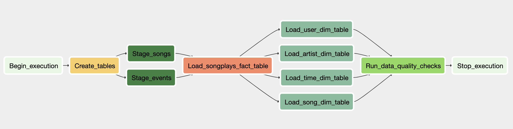

# airflow_data_pipelines

## Overview

This project builds an automated data pipeline using Airflow for a music streaming app called Sparkify, which runs hourly and performs extract-transform-load from s3 to Redshift on JSON logs of user activity and song metadata.

## DAG (Directed Acyclic Graph)

The tasks in the pipeline, their respective dependencies, and the order in which they need to be performed is summarized in this graph.

## Directory 

* `refshift_conn.py`: Establishes connection to AWS, creates a Redshift cluster with the specified params and checks for connection success.
* `sparkify_dag.py`: Defines the tasks that will be performed in the pipeline and specifies their order of operation. 
* `sql_queries.py`: Contains the SQL queries used to create, and insert data into, OLAP tables on Redshift.
* `create_tables.py`: Builds the Airflow operator class used to create tables on Redshift.
* `stage_redshift.py`: Builds the Airflow operator class used to copy data from s3 to staging tables on Redshift.
* `load_fact.py`: Builds the Airflow operator class used to insert data into the fact table of the STAR schema; songplays. 
* `load_dimension.py`: Builds the Airflow operator class used to insert data into the dimension tables in the STAR schema; songs, artists, time and users.
* `data_quality.py`: Builds the Airflow operator class used to run data quality checks on the loaded data to ensure the ETL process has completed succesfully.

## Tech Stack
* AWS (S3, Redshift)
* Airflow
* Python 3.7
